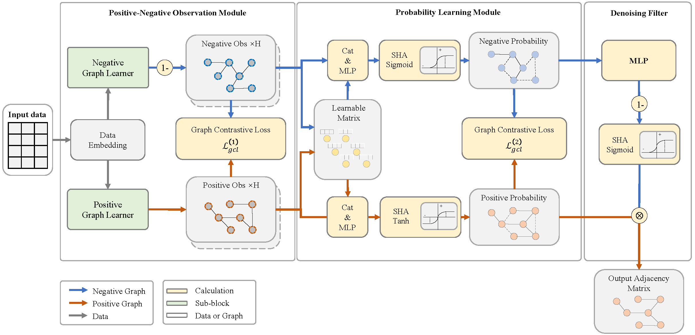
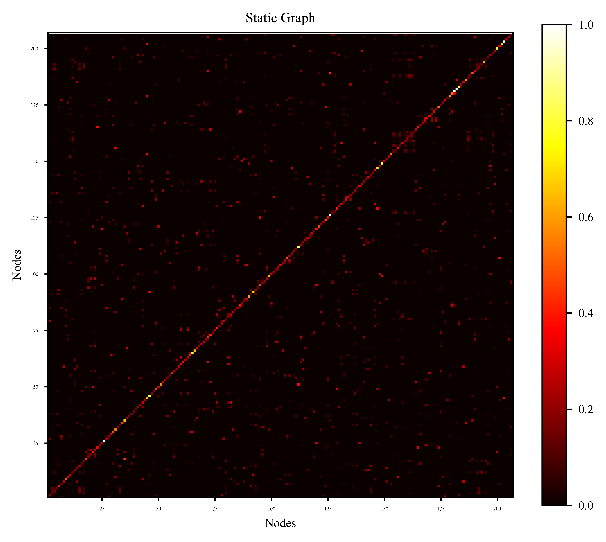
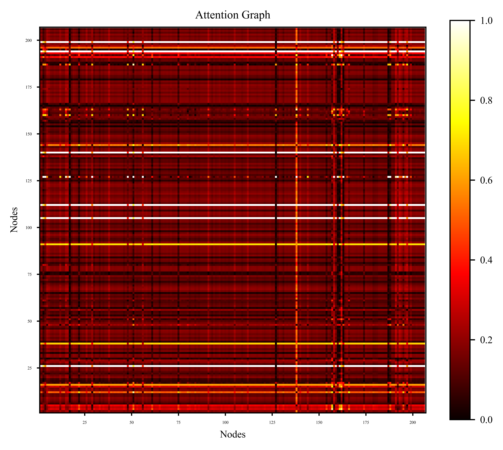
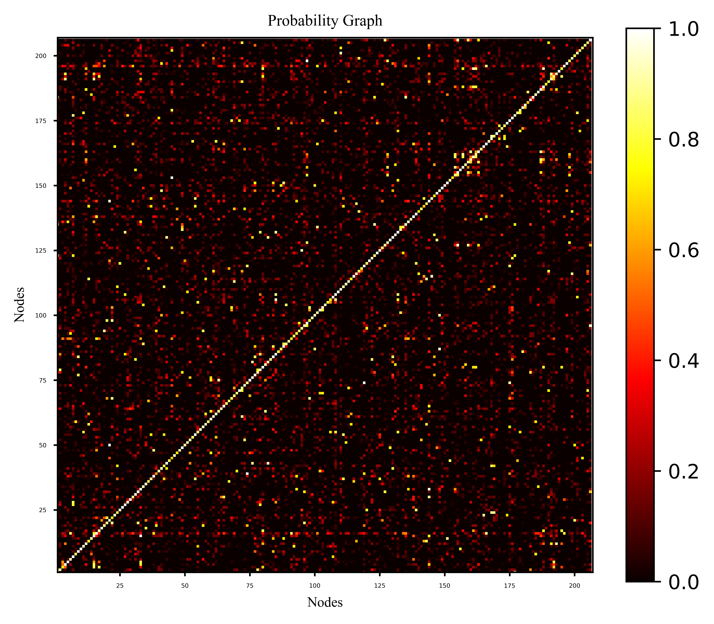
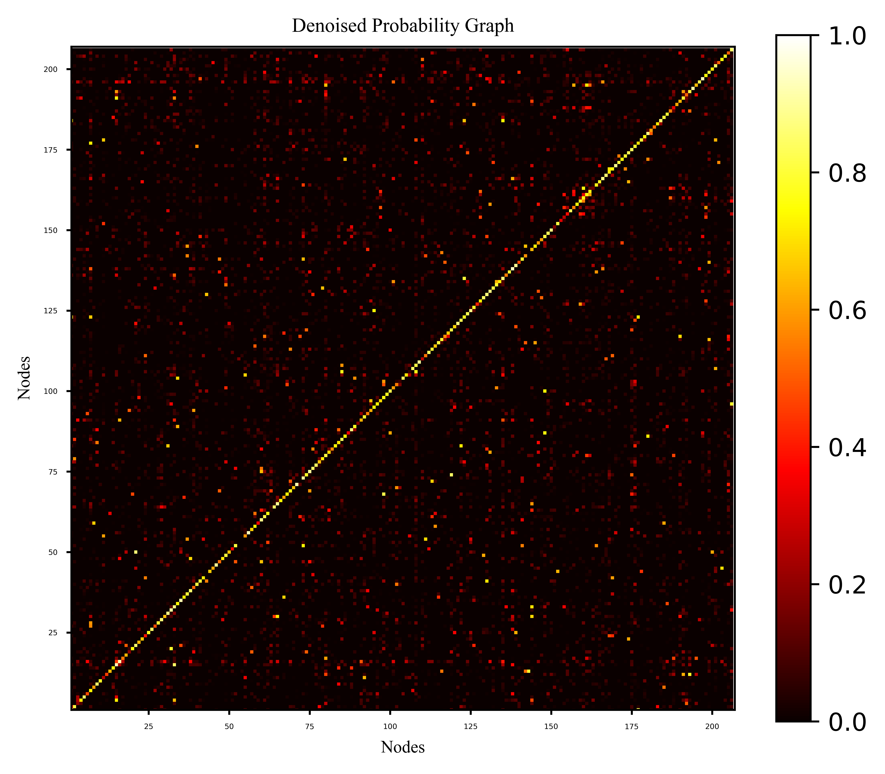

# 🚀 CLGSDN: Contrastive-Learning-Based Graph Structure Denoising Network

This repository is the official PyTorch implementation of the IEEE Internet of Things Journal (JIOT) paper titled "**CLGSDN: Contrastive-Learning-Based Graph Structure Denoising Network for Traffic Prediction**".

<p align="center">
  <b>English</b> | <a href="./README_CN.md">中文说明</a>
</p>

---

## 📖 Table of Contents
1. [Model Architecture](#-1-model-architecture)
2. [Motivation and Visualizations](#-2-motivation-and-visualizations)
3. [Data Preparation](#-3-data-preparation)
4. [Environment Setup](#-4-environment-setup)
5. [Running Experiments](#-5-running-experiments)
6. [Experimental Details and Reproduction](#-6-experimental-details-and-reproduction)
7. [Citation](#-7-citation)

---

## 🏗️ 1. Model Architecture

CLGSDN aims to solve the performance degradation of spatio-temporal models caused by noisy graph structures (either manually defined or automatically generated) in traffic prediction. The network mainly consists of three modules: the PNO module generates observations, the PLM module learns and memorizes the probability of the optimal graph, and the DF module removes noisy edges.

<p align="center">
  
  <br>
  <b>Figure 1: Overall architecture of CLGSDN.</b> It consists of three main modules: First, the PNO module generates observations from input data; second, the PL and Memory (PLM) module learns and memorizes the probability of the optimal graph; finally, the DF module removes noisy edges.
</p>

---

## 📊 2. Motivation and Visualizations

### 2.1 Limitations of Existing Graph Structures (Motivation)
Traditional static graphs are too sparse, while attention-based dynamic graphs capture more relationships but introduce significant unnecessary noise (weak connections).

<p align="center">
  
  
  <br>
  <b>Figure 2: Heatmap comparison of static graph vs. attention graph.</b> Black indicates no connection, white indicates strong connection. (a) The static graph contains only a few connections. (b) The attention graph includes almost all possible connections, but most are useless (weak connections shown in dark red).
</p>

### 2.2 Denoising Effect of CLGSDN (Our Solution)
CLGSDN effectively learns graph probabilities and performs denoising. The figure below shows the comparison before and after denoising.

<p align="center">
  
  
  <br>
  <b>Figure 3: Heatmap comparison of graphs generated by CLGSDN (Dataset: Metr-la, Backbone: STGCN).</b> (a) Initial probability graph. (b) Denoised probability graph. It can be observed that the overall image becomes darker after denoising, indicating that the weak connections (noise) represented by dark red have been removed.
</p>

---

## 📂 3. Data Preparation

Please ensure your working directory is structured as follows:

```text
├─datasets
│ └─raw_dataset
│   ├─metr_la
│   ├─pems_bay
│   ├─pems04
│   └─pems08
├─configs
├─model
├─utils
├─engine.py
└─exp.py
```

* **Data Download**: [Google Drive](https://drive.google.com/file/d/1gt4f9-NlcH6IKBzsDsTSUaaPrUONIgqV/view?usp=sharing). After downloading, extract it into the `datasets/raw_dataset` directory.

---

## 🛠️ 4. Environment Setup

### 4.1 Create and Activate Environment

```bash
# Create environment (Python 3.11 recommended)
conda create -n CLGSDN_envs python=3.11 -y
# Activate environment
conda activate CLGSDN_envs
```

### 4.2 Install PyTorch (Core Step)

Due to differences in hardware (CPU/GPU) and CUDA versions, **please ensure you install the PyTorch version compatible with your own device environment**.

1.  Visit the [PyTorch Official Local Installation Page](https://pytorch.org/get-started/locally/).
2.  Generate and execute the installation command based on your OS, Package (Conda/Pip), and CUDA version.

### 4.3 Install Other Dependencies

```bash
# Install basic dependencies
pip install -r requirements.txt

# Note: PyTables sometimes fails to install via pip; you can try using conda
# conda install pytables
```

---

## 🏃 5. Running Experiments

### 5.1 Basic Command

```bash
python exp.py --model <model> --dataset <data> --GSL <generator> [other arguments]
```

### 5.2 Argument Description

| Argument | Type | Key Options | Description |
| :--- | :--- | :--- | :--- |
| `--model` | Str | `agcrn`, `astgcn`, `tgcn`, `gw`, `dstagnn`, `dcrnn`, etc. | Specify the backbone prediction model. |
| `--dataset` | Str | `metr_la`, `pems_bay`, `pems04`, `pems08` | Specify the dataset. |
| `--GSL` | Str | `CLGSDN`, `None` | `CLGSDN`: Use our graph generator;<br>`None`: Use the dataset's original graph or identity matrix. |
| `--select_channels`| List[Int] | `0`, `1`, `2`, `-1` | **Core parameter, please select correctly based on the data:**<br>• Metr-la/Pems-bay: Default is `0` (single channel only)<br>• Pems04/08: Use `0` for flow, `2` for speed<br>• TaxiBJ: Use `0` for Flow\_in, `1` for Flow\_out |
| `--n_prob` | Int | `3` (default) | Parameter related to the probability graph. |
| `--device` | Str | `cuda:0`, `cpu` | Specify the runtime device. |

### 5.3 Quick Experiment Examples (Graph WaveNet)

The following commands demonstrate comparative experiments with and without CLGSDN for Graph WaveNet (gw) on different datasets.

```bash
# === Metr-la ===
# With CLGSDN (Ours)
nohup python -u exp.py --model gw --dataset metr_la --GSL CLGSDN --n_prob 3 --select_channels 0 --device cuda:0 > ./logs/CLGSDNxGW_on_metr-la.log &
# Without CLGSDN (Baseline)
nohup python -u exp.py --model gw --dataset metr_la --GSL None --select_channels 0 --device cuda:0 > ./logs/GW_on_metr-la.log &

# === Pems-bay ===
# With CLGSDN (Ours)
nohup python -u exp.py --model gw --dataset pems_bay --GSL CLGSDN --n_prob 3 --select_channels 0 --device cuda:0 > ./logs/CLGSDNxGW_on_pems-bay.log &
# Without CLGSDN (Baseline)
nohup python -u exp.py --model gw --dataset pems_bay --GSL None --select_channels 0 --device cuda:0 > ./logs/GW_on_pems-bay.log &

# === Pems04 (Select flow channel 0) ===
# With CLGSDN (Ours)
nohup python -u exp.py --model gw --dataset pems04 --GSL CLGSDN --n_prob 3 --select_channels 0 --device cuda:0 > ./logs/CLGSDNxGW_on_pems04.log &
# Without CLGSDN (Baseline)
nohup python -u exp.py --model gw --dataset pems04 --GSL None --select_channels 0 --device cuda:0 > ./logs/GW_on_pems04.log &

# === Pems08 (Select speed channel 2) ===
# With CLGSDN (Ours)
nohup python -u exp.py --model gw --dataset pems08 --GSL CLGSDN --n_prob 3 --select_channels 2 --device cuda:0 > ./logs/CLGSDNxGW_on_pems08.log &
# Without CLGSDN (Baseline)
nohup python -u exp.py --model gw --dataset pems08 --GSL None --select_channels 2 --device cuda:0 > ./logs/GW_on_pems08.log &
```

---

## 📊 6. Experimental Results Analysis and Interpretation

### 📝 Result Interpretation
* **Experimental logs**: During or after the experiment, you can find the corresponding experimental logs in `./datasets/results/logs/`.
* **Final Report**: After the program finishes, the test results corresponding to the epoch with the minimum validation loss will be output in the log.

### 🛠️ Experimental Result Analysis Tool

* We provide an experimental result analysis tool `./tools/analyse_tools.py`, which automatically extracts results from all experiments and generates an Excel file, allowing you to visually compare the performance of different experimental configurations.
* The tool includes a **Notes** column, the content of which comes from the text note added via the `--notes <your note>` argument when starting the experiment.
* The generated Excel file contains detailed MAE for 12 time steps (Step 1-12). For example: Step 3 (15 min), Step 6 (30 min), Step 12 (1 hour).

---

## 📜 7. Citation

If you find this work helpful for your research, please consider citing:

```bibtex
@ARTICLE{10757324,
  author={Peng, Peng and Chen, Xuewen and Zhang, Xudong and Tang, Haina and Shen, Hanji and Li, Jun},
  journal={IEEE Internet of Things Journal}, 
  title={CLGSDN: Contrastive-Learning-Based Graph Structure Denoising Network for Traffic Prediction}, 
  year={2025},
  volume={12},
  number={7},
  pages={8638-8652},
  doi={10.1109/JIOT.2024.3502517}
}
```